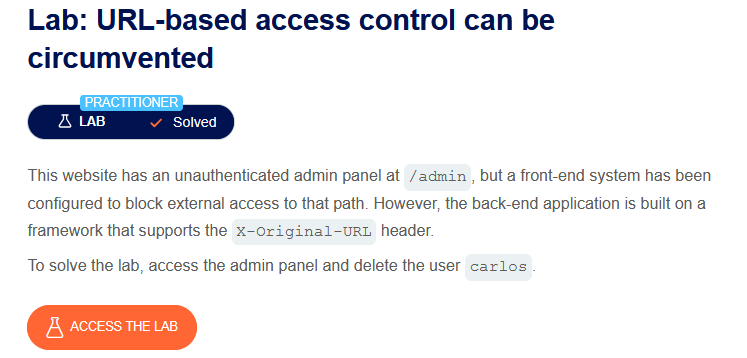
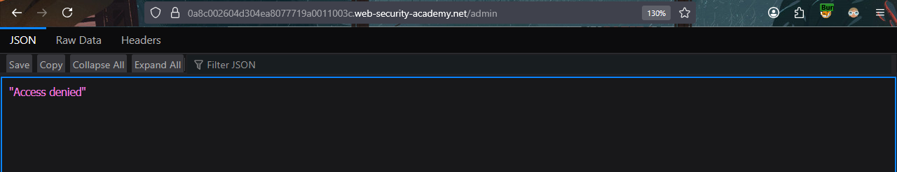
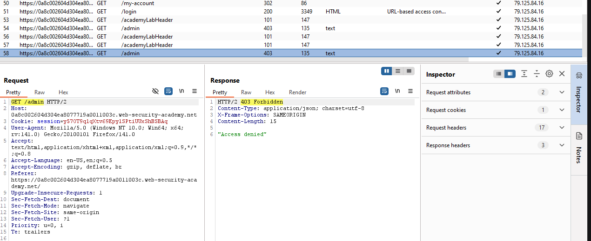
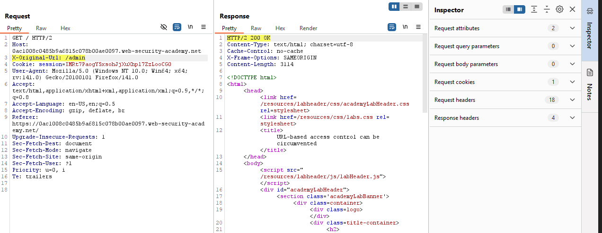
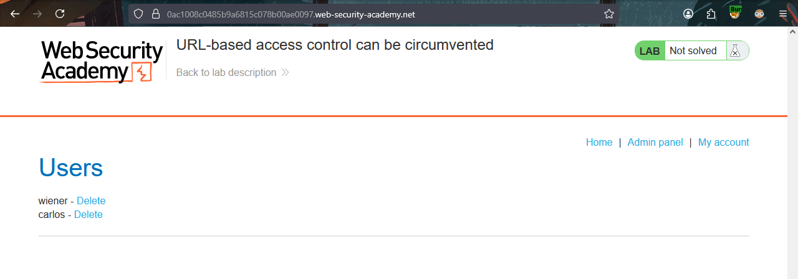
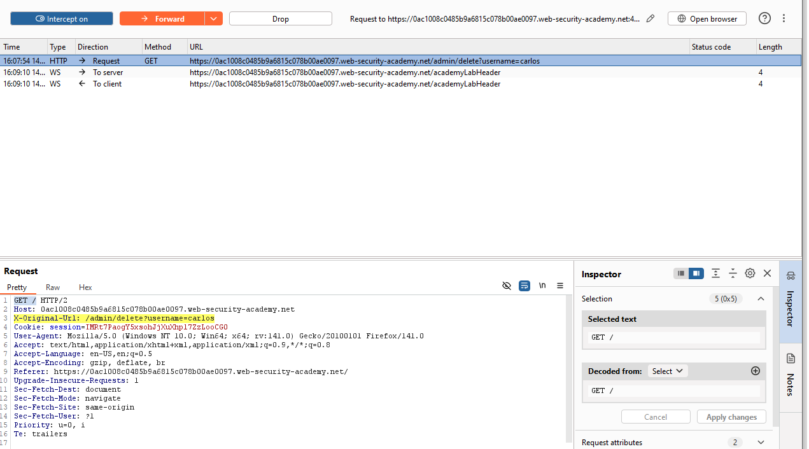
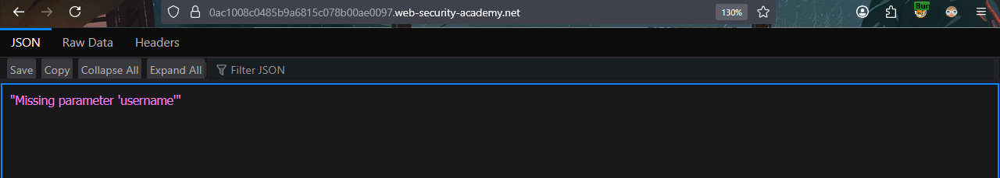
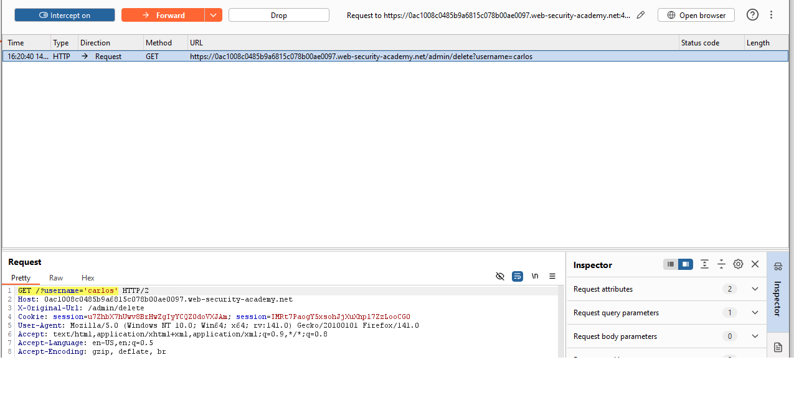
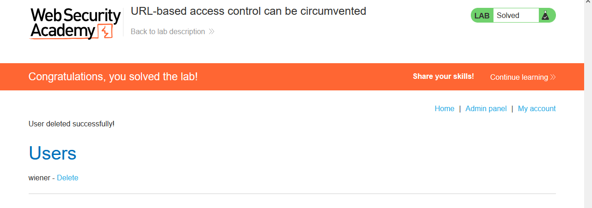

# URL-based access control can be circumvented
  
This is a brief write-up of the 1st **PRACTITIONER** access control lab from PortSwigger Web Security Academy.

---
## 🧩 Challenge Information

Click the **“Access the Lab”** button to launch a temporary website created for your account.

**Objective**: Bypass the block external access to admin panel and delete `carlos` user.

---
## 🔍 Investigation

Our first step, try a simple bypass.
 - Manually entering `/admin` at URL.
 - See if `robots.txt` is accessible.
 - Is there something interesting in the page source?
 - Observe requests while trying to access the admin panel.

Although the request is blocked. We can test adding `X-Original-Url` or `X-Rewrite-Url` headers to the request and observe the response.

Since the `/admin` is being blocked, add the path `/` instead of `/admin` to the GET request, and add the desired path `/admin` as a value to the `X-Original-Url` header.
- If the server **ignores** the header, we'll just get the `/` page as normal.
- If the server **honors** it, you might get the `/admin` page (or at least a different status code).

> `X-Original-Url` and `X-Rewrite-Url` are headers that replace the requested URL path with the given value from the header. So it's usually used for bypassing front-end restrictions. 

---
## 🚨 Exploitation

We got a different status code `200 OK`, and the page is accessible!
after the request was sent to "Repeater", and adding `X-Original-Url:/admin`, and changing the `GET /admin `to `/`.

**What happened** is the server read the `GET` request and its path, since it's not `/admin`, it got allowed, since it is not in the blocklist paths.
Then the `X-Original-Url` replaces the requested URL path with the`/admin` from the header **before routing internally**.

Now we can **intercept** the request from the browser while trying to access `/admin`.
and repeat what we did at the "Repeater".

 

Keep the interception on and click on delete `carlos` user, and add the header as we did earlier.

We've got a missing parameter, "username". Let's try again and change the path accordingly.

Add the username parameter to `GET` (`?username=carlos`) while keeping the path `/admin/delete` to the header.

 

Try to access the admin panel again, and it will show that we have solved the lab!

---
 *This lab demonstrated that relying solely on URL-based access control is insecure, as attackers can bypass restrictions simply by navigating to hidden endpoints.*