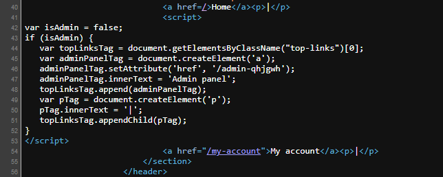

# Unprotected admin functionality with unpredictable URL
  
This is a brief write-up of the second **APPRENTICE** access control lab from PortSwigger Web Security Academy.

---
## 🧩 Challenge Information

Click the **“Access the Lab”** button to launch a temporary website created for your account.

**Objective**: Locate an unprotected admin panel and delete the `carlos` user.  

---
## 🔍 Investigation

During investigations, we should view the page source code to understand how does it work.

We found a very interesting JS code. in short. The admin URL is disclosed in JavaScript on which constructs the user interface based on the user's role.

This script adds a link to the user's UI if they are an admin user. However, the script containing the URL is visible to all users regardless of their role!

---
## 🚨 Exploitation

Look closely at line 46, here it says -_if the current user is an admin_- an element (a) will be created linked with `/admin-qhjgwh` so on click it will redirect you to the admin panel page.

We have **accessed the admin panel** simply by typing `/admin-qhjgwh`at the end of the URL, bypassing any login requirements. This exposed a critical flaw, allowing an attacker to perform privileged actions, such as deleting the `carlos` user.

 *This second lab reinforced how subtle authorization oversights can quietly undermine an entire application’s security—another step forward in sharpening my pentesting instincts.*