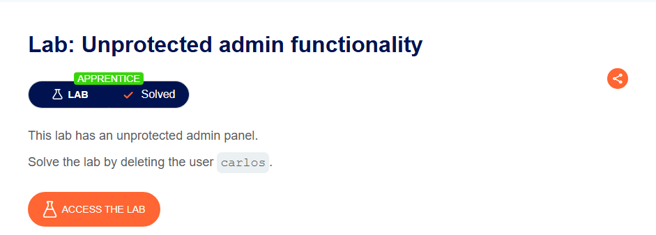
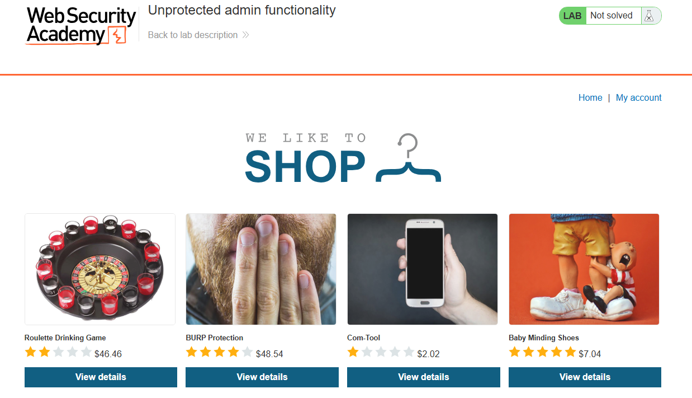
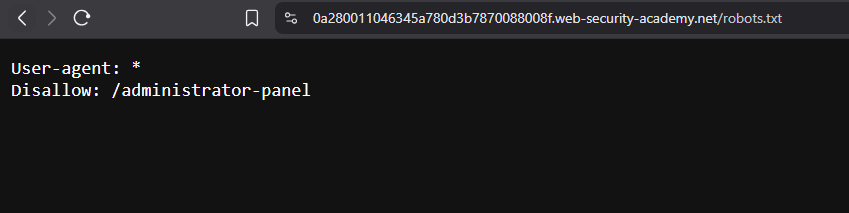
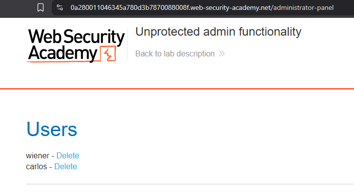
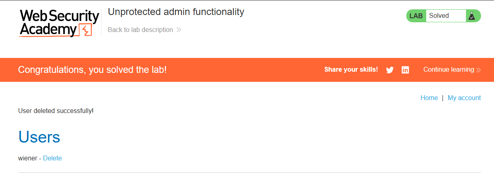

This is a super brief writeup of the first Apprentice-level access control lab from Portswigger Academy.
## 🧩 Challenge Information

Click the “**Access the Lab**” button and you will be taken to a temporary website that is created for your account.

**Objective**: Find an unprotected admin panel and delete the `carlos` user.  

## 🔍 Investigation 

Nothing interesting here—unless we check out `robots.txt`.That’s where things start to get interesting

> **`robots.txt`** *is a website directive that tells search engine crawlers which pages or sections to avoid.* 

As we can observe, the `/administrative-panel` is listed as disallowed in `robots.txt`. But let’s try visiting it anyway—who knows what we might find?

## 🚨 Exploitation

 And just like that—we **accessed the admin panel** simply by entering its URL, bypassing any login requirements. This exposed a critical vulnerability, allowing us to perform privileged actions like deleting the `carlos` user.

*This first lab was a solid reminder that even the simplest flaws can open the door to serious vulnerabilities—onward to the next challenge.*