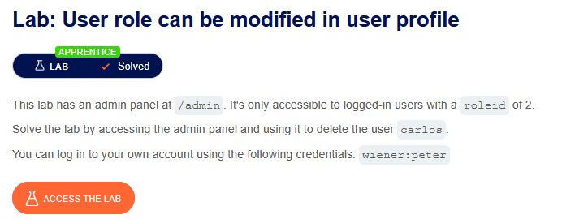
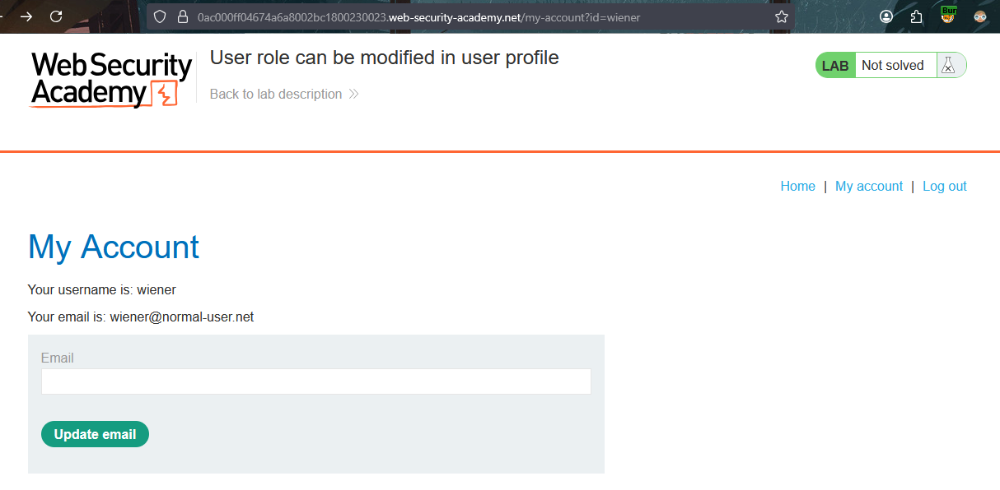
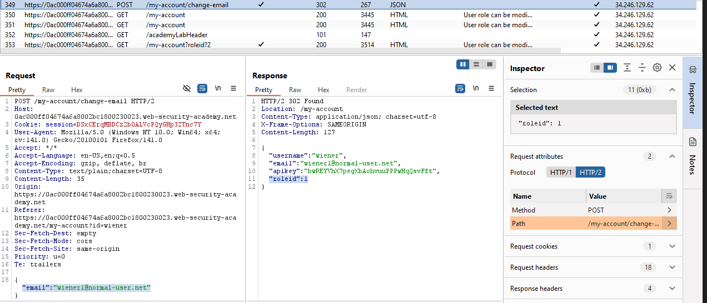
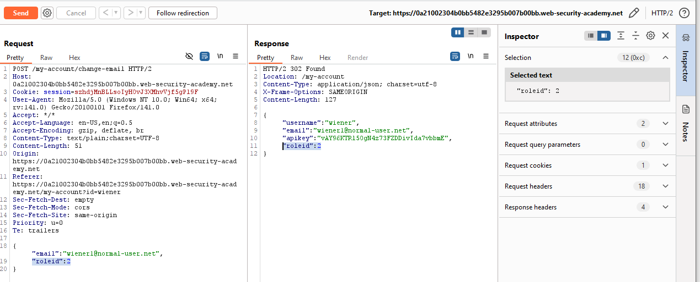
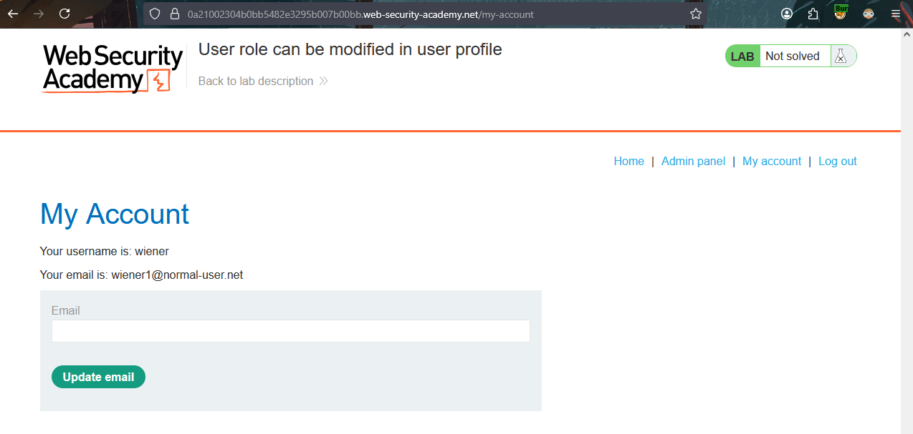
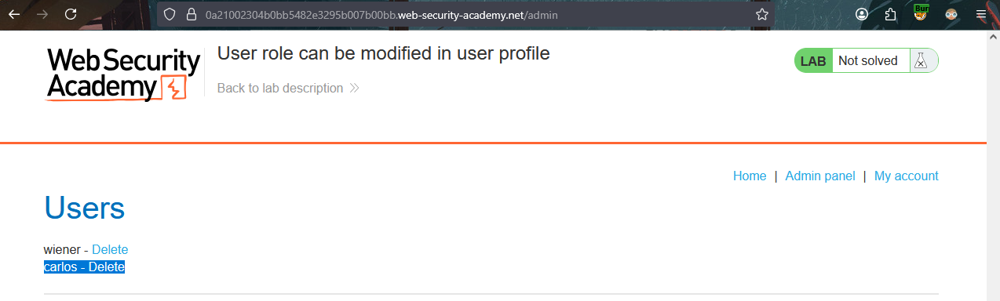
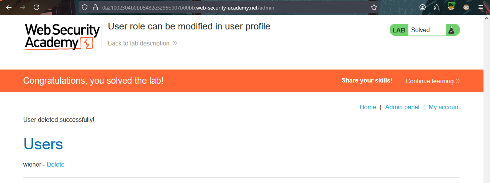

# User role can be modified in user profile
  
This is a brief write-up of the 4th **APPRENTICE** access control lab from PortSwigger Web Security Academy.

---
## 🧩 Challenge Information

Click the **“Access the Lab”** button to launch a temporary website created for your account.

**Objective**: Locate the admin panel with `rodeid=2` and delete `carlos` user.

---
## 🔍 Investigation

Visiting every webpage while observing requests and responses is an essential step. Log in - Log out - Visit pages while logged in and try them without. Try to use all functions as possible to understand how website requests work.

While changing the email and observing the request, we found the POST request body contains "email" key and its new value that should be changed to. 
The response contained some more keys like `username`, `apikey`, and `roleid` with value 1.

As usual, let's try sending the request to `Repeater` while adding the `roleid` key to the request body and setting its value to 2. 

We got status code `302 FOUND` and the response body contained `roleid=2`, which means we have successfully changed the `roleid` of the `Wiener` user to 2 on the server!
 
---
## 🚨 Exploitation

Now, let's try accessing the `my account `page again, and we should see a new hyperlink "Admin Panel".

**Admin Panel hyperlink is here!** 
A new anchor tag was shown with a hyperlink to the "Admin Panel" page.

Now we can delete the `Carlos` user and complete the lab.

---
 *This lab highlighted how inadequate server-side access checks allow privilege bypass, emphasizing that role enforcement must never rely solely on client-supplied data.* 