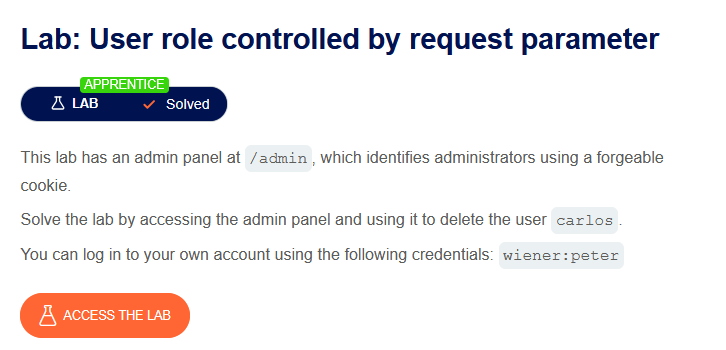
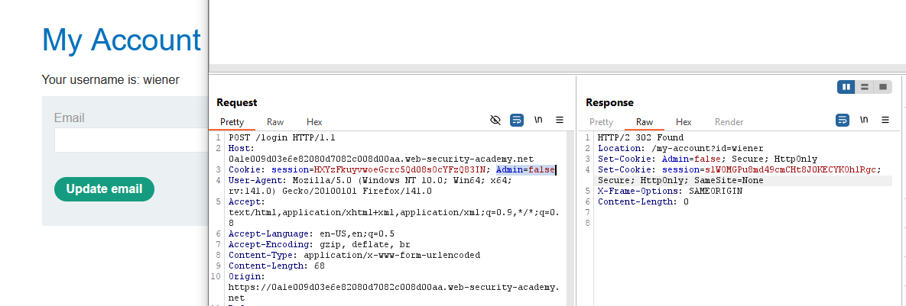
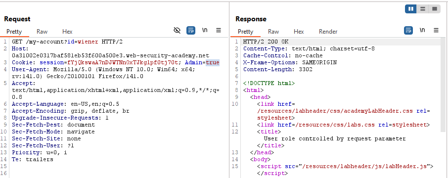
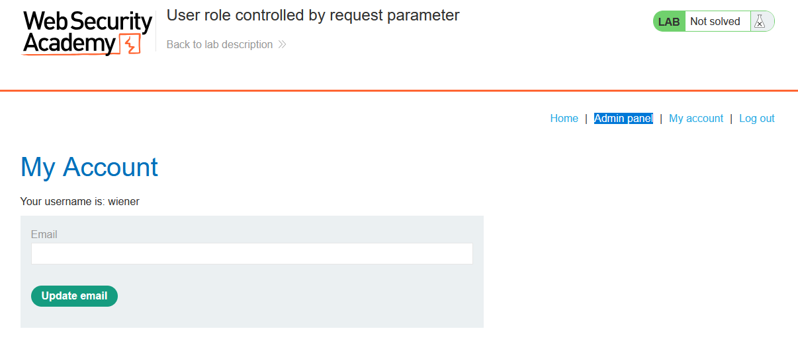
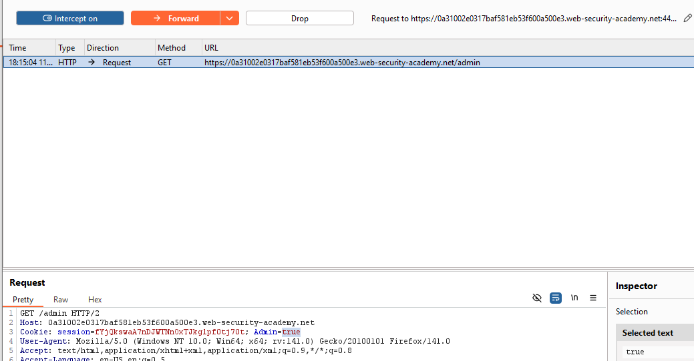
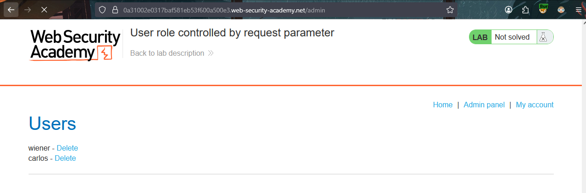
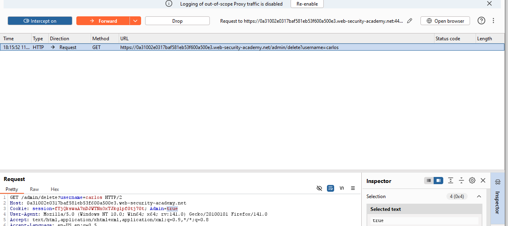
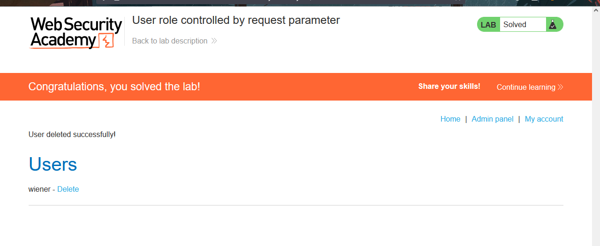

# # User role controlled by request parameter
  

This is a brief write-up of the 3rd **APPRENTICE** access control lab from PortSwigger Web Security Academy.

---
## 🧩 Challenge Information

Click the **“Access the Lab”** button to launch a temporary website created for your account.

**Objective**:  Locate an unprotected admin panel and delete the `carlos` user.

---
## 🔍 Investigation

While observing requests using burp, the cookies are sent to the server with an admin value set to `false` as we are logged in as normal user. 

Send it to the repeater so we can test whether changing the value to `true` will return code `200 OK `or `304 FOUND`.

It worked! the server checks the admin privilege using only cookies admin value. which is a dangerous vulnerability.

---
## 🚨 Exploitation

Bypassing role controlled by request parameter and accessing admin panel needs some steps:
	1- Visiting `My account` page as Weiner.
	2- Turn on interception mode.
	3- Reload the page 
	4- Edit the `cookie`header on every request send.  

Enable interception and refresh the page. Then edit the cookies header to set `Admin=true` as we did at repeater then forward the request.
 

"Admin Panel" appeared at the page, Click on it while the interception is on.

Edit the cookies header to `Admin=true` again then forward the request. 

 
 Congrats on accessing the admin panel! 
 A few more steps needed to delete `carlos` account.
 
  
  
 *Don't forget, we are still intercepting requests.*
 After clicking "Delete" for `carlos` account, edit the cookies header again.

 
 
 Exploitation accomplished successfully!
  
 ---
 
 *This lab demonstrated how manipulating the request parameter controlling user roles can escalate privileges, reinforcing the need for server-side role validation.* 